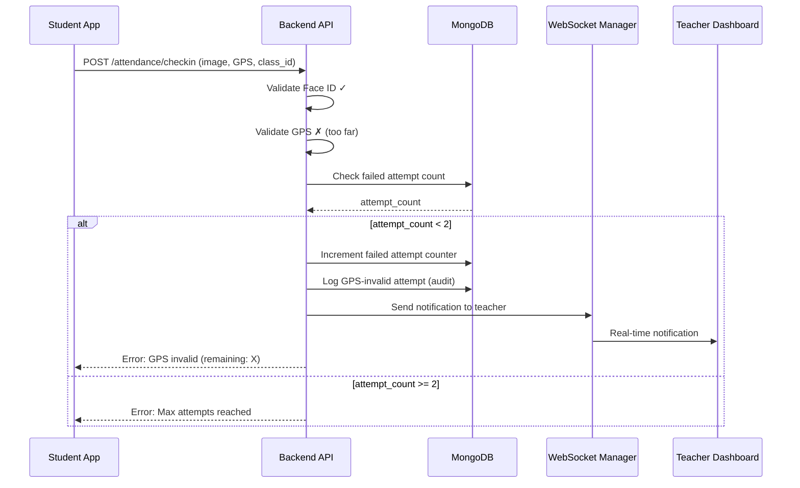

# Design Document: GPS Invalid Attendance with Teacher Notification

## Overview

Tính năng này mở rộng hệ thống điểm danh hiện tại để xử lý trường hợp sinh viên có Face ID hợp lệ nhưng vị trí GPS không hợp lệ (quá xa trường). Hệ thống sẽ:
- Từ chối điểm danh nhưng cho phép thử lại tối đa 2 lần/ngày/lớp
- Gửi thông báo realtime đến giáo viên qua WebSocket
- Hiển thị thông tin chi tiết cho cả sinh viên và giáo viên
- Ghi log audit cho mục đích theo dõi

## Architecture



## Components and Interfaces

### 1. Backend API Changes

#### Modified Endpoint: `/attendance/checkin`

```python
# New response structure for GPS-invalid with valid Face ID
{
    "status": "failed",
    "error_type": "gps_invalid",  # Distinguish from "face_invalid"
    "message": "❌ Vị trí không hợp lệ. Bạn cách trường {distance}m",
    "details": {
        "face_valid": True,
        "gps_valid": False,
        "distance_meters": 500,
        "max_distance_meters": 100,
        "attempt_number": 1,
        "remaining_attempts": 1,
        "student_enrolled": True
    }
}
```

#### New Collection: `gps_invalid_attempts`

```python
# Schema for tracking GPS-invalid attempts
{
    "_id": ObjectId,
    "student_id": ObjectId,
    "class_id": ObjectId,
    "date": "2025-12-25",  # ISO date string
    "attempt_count": 1,
    "last_attempt_time": datetime,
    "attempts": [
        {
            "timestamp": datetime,
            "latitude": float,
            "longitude": float,
            "distance_meters": float,
            "face_similarity": float
        }
    ]
}
```

#### New Collection: `gps_invalid_audit_logs`

```python
# Schema for audit logging
{
    "_id": ObjectId,
    "student_id": ObjectId,
    "student_username": str,
    "student_fullname": str,
    "class_id": ObjectId,
    "class_name": str,
    "timestamp": datetime,
    "gps_coordinates": {
        "latitude": float,
        "longitude": float
    },
    "distance_from_school": float,
    "face_validation": {
        "is_valid": True,
        "similarity_score": float
    },
    "attempt_number": int,
    "notification_sent": bool,
    "teacher_id": ObjectId
}
```

### 2. WebSocket Notification Structure

```python
# Notification payload for GPS-invalid attendance
{
    "type": "gps_invalid_attendance",
    "class_id": str,
    "student_id": str,
    "student_username": str,
    "student_fullname": str,
    "class_name": str,
    "timestamp": str,  # ISO format
    "gps_distance": float,
    "status": "gps_invalid",
    "message": "GPS không hợp lệ",
    "is_enrolled": bool,
    "warning_flags": []  # e.g., ["not_enrolled"] if applicable
}
```

### 3. Frontend Components

#### RandomActionAttendanceModal Updates

```typescript
// New state for GPS-invalid handling
interface GPSInvalidState {
    isGPSInvalid: boolean;
    distance: number;
    attemptNumber: number;
    remainingAttempts: number;
    maxAttemptsReached: boolean;
}

// New error display component
function GPSInvalidError({ state }: { state: GPSInvalidState }) {
    if (state.maxAttemptsReached) {
        return <Text>❌ Đã hết số lần thử. Vui lòng thử lại vào ngày mai.</Text>;
    }
    return (
        <View>
            <Text>❌ Vị trí không hợp lệ ({state.distance}m từ trường)</Text>
            <Text>Còn {state.remainingAttempts} lần thử</Text>
        </View>
    );
}
```

#### Teacher Dashboard Updates

```typescript
// New notification type handling
interface GPSInvalidNotification {
    type: 'gps_invalid_attendance';
    student_username: string;
    student_fullname: string;
    class_name: string;
    timestamp: string;
    gps_distance: number;
    is_enrolled: boolean;
    warning_flags: string[];
}

// Notification display with visual distinction
function NotificationItem({ notification }: { notification: GPSInvalidNotification }) {
    const isWarning = notification.type === 'gps_invalid_attendance';
    return (
        <View style={[styles.notification, isWarning && styles.warningNotification]}>
            <Text>{notification.student_fullname}</Text>
            <Text style={styles.warningText}>⚠️ GPS không hợp lệ ({notification.gps_distance}m)</Text>
            {!notification.is_enrolled && (
                <Text style={styles.alertText}>⛔ Sinh viên không có trong lớp!</Text>
            )}
        </View>
    );
}
```

## Data Models

### GPSInvalidAttempt Model

```python
class GPSInvalidAttempt(BaseModel):
    student_id: str
    class_id: str
    date: str
    attempt_count: int
    last_attempt_time: datetime
    attempts: List[AttemptDetail]

class AttemptDetail(BaseModel):
    timestamp: datetime
    latitude: float
    longitude: float
    distance_meters: float
    face_similarity: float
```

### GPSInvalidNotification Model

```python
class GPSInvalidNotification(BaseModel):
    type: str = "gps_invalid_attendance"
    class_id: str
    student_id: str
    student_username: str
    student_fullname: str
    class_name: str
    timestamp: str
    gps_distance: float
    status: str = "gps_invalid"
    message: str
    is_enrolled: bool
    warning_flags: List[str] = []
```

## Correctness Properties

*A property is a characteristic or behavior that should hold true across all valid executions of a system-essentially, a formal statement about what the system should do. Properties serve as the bridge between human-readable specifications and machine-verifiable correctness guarantees.*

### Property 1: GPS-Invalid Attendance Rejection

*For any* attendance submission where Face ID is valid but GPS distance exceeds the allowed radius, the system SHALL reject the attendance, return error_type "gps_invalid", include the distance in the response, and NOT create a successful attendance record.

**Validates: Requirements 1.1, 1.2, 1.3, 1.4**

### Property 2: Attempt Counter Consistency

*For any* sequence of GPS-invalid attendance attempts by a student for a class on a given day, the attempt counter SHALL increment correctly, block attempts after reaching 2, display remaining attempts accurately, and reset at the start of a new day.

**Validates: Requirements 2.1, 2.2, 2.3, 2.4**

### Property 3: Teacher Notification Delivery

*For any* GPS-invalid attendance attempt with valid Face ID, the system SHALL send a WebSocket notification to the teacher of that class containing student username, full name, class name, timestamp, GPS distance, and status message.

**Validates: Requirements 3.1, 3.2, 3.3**

### Property 4: Enrollment Verification in Notifications

*For any* GPS-invalid attendance notification, the system SHALL verify student enrollment in the class, indicate enrollment status in the notification, and include a warning flag if the student is not enrolled.

**Validates: Requirements 4.1, 4.2, 4.3**

### Property 5: Audit Log Completeness

*For any* GPS-invalid attendance attempt, the system SHALL create an audit log entry containing student_id, class_id, timestamp, GPS coordinates, distance, Face ID result, and attempt number in the dedicated audit collection.

**Validates: Requirements 7.1, 7.2, 7.3**

## Error Handling

### GPS Validation Errors

| Error Code | Condition | Response |
|------------|-----------|----------|
| `gps_invalid` | Distance > max_radius, Face ID valid | Return distance, remaining attempts |
| `gps_invalid_max_attempts` | Attempts >= 2 | Block further attempts for today |
| `face_invalid` | Face ID similarity < threshold | Standard face validation error |
| `both_invalid` | Both GPS and Face ID invalid | Return face validation error first |

### WebSocket Connection Errors

- If teacher is disconnected: Store notification in `pending_notifications` collection
- If WebSocket send fails: Log error, retry once, then store for later
- Teacher reconnection: Send all pending notifications

### Database Errors

- Attempt counter update fails: Log error, allow attendance attempt (fail-open for UX)
- Audit log fails: Log error, continue with attendance flow (non-blocking)

## Testing Strategy

### Unit Tests

1. **GPS Validation Logic**
   - Test distance calculation accuracy
   - Test boundary conditions (exactly at radius)
   - Test with various coordinate formats

2. **Attempt Counter Logic**
   - Test increment behavior
   - Test blocking at limit
   - Test day reset logic

3. **Notification Payload**
   - Test all required fields present
   - Test enrollment flag accuracy
   - Test warning flags

### Property-Based Tests

Property-based testing validates universal properties across many generated inputs. Each property test should run minimum 100 iterations.

1. **Property 1 Test**: Generate random attendance requests with valid face embeddings but GPS coordinates outside valid radius. Verify rejection, error type, distance inclusion, and no successful record.

2. **Property 2 Test**: Generate sequences of GPS-invalid attempts. Verify counter increments, blocking at 2, remaining attempts accuracy, and day reset.

3. **Property 3 Test**: Generate GPS-invalid attempts and verify WebSocket notifications contain all required fields and are sent to correct teacher.

4. **Property 4 Test**: Generate attempts with both enrolled and non-enrolled students. Verify enrollment status and warning flags in notifications.

5. **Property 5 Test**: Generate GPS-invalid attempts and verify audit logs contain all required fields in correct collection.

### Integration Tests

1. **End-to-End Flow**
   - Student submits GPS-invalid attendance
   - Verify error response
   - Verify teacher receives notification
   - Verify audit log created

2. **Attempt Limit Flow**
   - Submit 3 GPS-invalid attempts
   - Verify first 2 return remaining attempts
   - Verify 3rd is blocked

3. **WebSocket Reconnection**
   - Disconnect teacher
   - Submit GPS-invalid attendance
   - Reconnect teacher
   - Verify pending notification delivered
