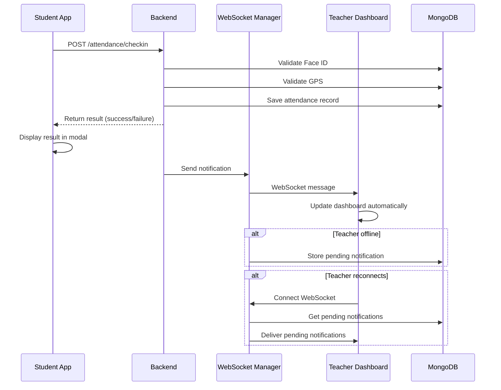

# Design Document: Real-time Attendance Notification

## Overview

Tài liệu này mô tả thiết kế chi tiết cho hệ thống thông báo điểm danh real-time. Hệ thống cho phép sinh viên nhận kết quả điểm danh ngay lập tức và giáo viên nhận thông báo real-time qua WebSocket mà không cần refresh dashboard.

## Architecture



## Components and Interfaces

### 1. Backend Components

#### 1.1 ConnectionManager (Enhanced)
```python
class ConnectionManager:
    """Manages WebSocket connections for real-time notifications"""
    
    active_connections: dict[str, WebSocket]  # teacher_id -> websocket
    
    async def connect(websocket: WebSocket, teacher_id: str) -> None
    async def disconnect(teacher_id: str) -> None
    async def send_notification(message: dict, teacher_id: str) -> bool
    async def broadcast_to_class_teachers(message: dict, class_id: str) -> None
    async def send_pending_notifications(teacher_id: str) -> None
```

#### 1.2 Notification Service
```python
class NotificationService:
    """Handles notification creation and delivery"""
    
    def create_attendance_notification(
        student_id: str,
        student_name: str,
        class_id: str,
        class_name: str,
        status: str,  # 'present', 'gps_invalid', 'face_invalid'
        validation_details: dict
    ) -> dict
    
    async def send_and_store(notification: dict, teacher_id: str) -> bool
```

#### 1.3 Face ID Setup (Cleaned)
```python
async def setup_faceid(data: FaceSetupRequest, current_user) -> dict:
    """
    Face ID setup with clean pose diversity handling.
    
    - Accepts minimal pose diversity (yaw >= 0.5°, pitch >= 0.5°)
    - Handles invalid frames gracefully
    - Requires minimum 8 valid frames
    - Returns clear Vietnamese error messages
    """
```

### 2. Frontend Components

#### 2.1 RandomActionAttendanceModal (Enhanced)
```typescript
interface AttendanceResult {
  status: 'success' | 'gps_invalid' | 'face_invalid' | 'error';
  message: string;
  validations: {
    face: { is_valid: boolean; similarity?: number };
    gps: { is_valid: boolean; distance_meters?: number };
  };
}

// Display result immediately after check-in
const displayResult = (result: AttendanceResult) => {
  setPhase('result');
  setResultData(result);
  // Show appropriate UI based on status
};
```

#### 2.2 Teacher Dashboard WebSocket Handler
```typescript
interface WebSocketNotification {
  type: 'attendance_update' | 'gps_invalid_attendance';
  class_id: string;
  student_id: string;
  student_name: string;
  status: string;
  timestamp: string;
  message: string;
  validation_details?: {
    face?: { is_valid: boolean; similarity_score?: number };
    gps?: { is_valid: boolean; distance_meters?: number };
  };
}

// Auto-update dashboard on notification
const handleNotification = (notification: WebSocketNotification) => {
  // Update attendance records
  setAttendanceRecords(prev => updateRecords(prev, notification));
  // Update summary counts
  updateSummaryCounts(notification);
  // Show toast notification
  showToast(notification);
};
```

## Data Models

### 1. WebSocket Notification Message
```typescript
{
  type: string;           // 'attendance_update' | 'gps_invalid_attendance'
  class_id: string;       // MongoDB ObjectId as string
  student_id: string;     // MongoDB ObjectId as string
  student_name: string;   // Full name of student
  status: string;         // 'present' | 'gps_invalid' | 'face_invalid'
  timestamp: string;      // ISO 8601 format
  message: string;        // Vietnamese message
  check_in_time?: string; // ISO 8601 format
  validation_details?: {
    face?: {
      is_valid: boolean;
      similarity_score?: number;
    };
    gps?: {
      is_valid: boolean;
      distance_meters?: number;
    };
  };
}
```

### 2. Pending Notification (MongoDB)
```typescript
{
  _id: ObjectId;
  teacher_id: string;
  notification: WebSocketNotification;
  created_at: Date;
  delivered: boolean;
  delivered_at?: Date;
}
```

## Correctness Properties

*A property is a characteristic or behavior that should hold true across all valid executions of a system—essentially, a formal statement about what the system should do. Properties serve as the bridge between human-readable specifications and machine-verifiable correctness guarantees.*

### Property 1: Notification Contains Required Fields
*For any* WebSocket notification sent by the backend, the notification object SHALL contain all required fields: type, class_id, student_id, student_name, status, timestamp, message.
**Validates: Requirements 2.3, 6.1**

### Property 2: Successful Check-in Triggers Notification
*For any* successful attendance check-in, the backend SHALL send a WebSocket notification to the class teacher within 500ms of recording the attendance.
**Validates: Requirements 2.1**

### Property 3: GPS Invalid Triggers Notification with Distance
*For any* GPS-invalid attendance attempt, the notification SHALL include the distance_meters field in validation_details.gps.
**Validates: Requirements 2.2, 6.3**

### Property 4: Face Invalid Triggers Notification with Similarity
*For any* Face ID invalid attendance attempt, the notification SHALL include the similarity_score field in validation_details.face.
**Validates: Requirements 6.4**

### Property 5: Offline Teacher Gets Pending Notification
*For any* notification sent when teacher is offline, the notification SHALL be stored in pending_notifications collection and delivered when teacher reconnects.
**Validates: Requirements 2.4, 2.5**

### Property 6: Dashboard Updates on Notification
*For any* WebSocket notification received by Teacher Dashboard, the attendance records state SHALL be updated to reflect the new attendance status.
**Validates: Requirements 3.1, 3.2**

### Property 7: Pose Diversity Threshold Acceptance
*For any* Face ID setup with yaw_range >= 0.5° AND pitch_range >= 0.5° AND valid_frames >= 8, the setup SHALL succeed.
**Validates: Requirements 4.1, 4.4**

### Property 8: Invalid Frame Handling
*For any* invalid frame during Face ID setup, the system SHALL skip the frame and continue processing without crashing.
**Validates: Requirements 4.2, 4.3**

### Property 9: WebSocket Reconnection
*For any* WebSocket disconnection, the frontend SHALL attempt reconnection within 5 seconds.
**Validates: Requirements 3.5, 5.4**

## Error Handling

### Backend Errors
| Error | Response | Action |
|-------|----------|--------|
| WebSocket send fails | Log error | Store as pending notification |
| Invalid teacher_id | Log warning | Skip notification |
| Database error | Log error | Return 500 to client |
| Invalid frame in Face ID | Log warning | Skip frame, continue |

### Frontend Errors
| Error | Display | Action |
|-------|---------|--------|
| Check-in fails | Show error message | Allow retry |
| WebSocket disconnects | Show reconnecting indicator | Auto-reconnect |
| Network error | Show offline message | Retry with backoff |

## Testing Strategy

### Unit Tests
- Test notification message format validation
- Test ConnectionManager connect/disconnect
- Test pending notification storage/retrieval
- Test Face ID pose diversity calculation

### Property-Based Tests
- **Property 1**: Generate random notifications, verify all required fields present
- **Property 2**: Simulate check-ins, verify notification timing
- **Property 5**: Simulate offline teacher, verify pending storage and delivery
- **Property 7**: Generate random pose data, verify threshold acceptance
- **Property 8**: Generate invalid frames, verify no crashes

### Integration Tests
- End-to-end: Student check-in → Teacher notification
- WebSocket reconnection flow
- Pending notification delivery on reconnect

### Test Configuration
- Minimum 100 iterations per property test
- Use fast-check for TypeScript property tests
- Use hypothesis for Python property tests
